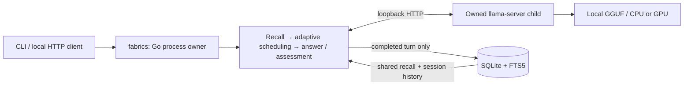

# Mini Fabrics architecture

Mini Fabrics is a new implementation in `matthewalexandern/AI`. The available GitHub repository listing exposed `AI`, `MCPServers`, and `Patching`; their inspected branches contained placeholder documentation. The larger prior runtime could not be located, so this implementation does not claim to reproduce or inherit its code.

The Go executable owns configuration, process lifecycle, inference requests, cognitive orchestration, and persistence. `ask`, `chat`, and `serve` each start one `llama-server` child with a local model and stop it on completion or handled termination. The child listens on `127.0.0.1`, uses one inference slot, and receives requests from a Go client that bypasses HTTP proxies and denies redirects. Go serializes requests to that slot. CPU mode explicitly disables GPU offload; CUDA, Metal, and Vulkan require a matching build and working platform drivers.

`serve` exposes the cognitive and memory API only on a loopback IP. Browser-origin requests are rejected. The loopback interfaces are intended for local clients; session identifiers separate conversation history and are not authentication or user authorization. Inference has no autonomous tool interface, shell execution, network browsing, or external action dispatch. Installation downloads are a separate workflow.

`internal/memory` uses the pure-Go SQLite driver with WAL and foreign keys. Schema v2 migrates v1 databases without discarding history. `turns` stores the user request, final answer, task outline, final assessment JSON, model name, confidence, recalled IDs, cognition scheduling metadata, and timestamp. `messages` stores session-specific user/assistant history. `memories` stores explicit notes and completed episodes. The `memories_fts` FTS5 index is maintained by triggers; ordinary query text is converted to quoted words and ranked with BM25. Recall searches all memories in the local database, including episodes from other sessions. History and episode reads filter by session. One transaction saves a completed turn, both messages, and its searchable episode.

Adaptive scheduling selects fast, balanced, or deep from request structure, length, history, and recalled evidence. Explicit mode selection overrides scheduling. Fast makes one answer call and returns `assessed: false`; its compatibility confidence value of zero is not a measured judgment. Balanced makes an answer and assessment; deep also makes a high-level task outline. Maximum budgets are one, four, and five calls respectively. Selected mode, reason, budget, calls, phases, duration, and assessment availability persist with the turn. Confidence never controls scheduling. An assessment may request one revision, followed by one reassessment; there is no further loop even if the final assessment still requests revision. Assessment confidence is model-reported and is not independently calibrated or verified. Prompts ask the model to identify uncertainty, missing evidence, and assumptions. Retrieved records and generated references are quoted as untrusted data within one current-user message, and truncated optional references are marked. History contains complete alternating user/assistant turns so stricter chat templates can accept every phase. The workflow requests concise outputs rather than private reasoning traces. Malformed assessments, inference failures, cancellation, and required-context overflow save no partial turn.

Assessment and reassessment use llama.cpp's JSON Schema response format with exactly four fields: `confidence`, `needs_revision`, `notes`, and `missing`. The controller also strictly validates the returned JSON. The reviewer receives the original request and candidate answer together as quoted evaluation data, along with available history and recalled evidence; it does not receive the generated outline. Schema constraints prevent malformed fields, but cannot make a model's judgment reliable. Real Qwen2.5 0.5B and 1.5B checks produced correct answers and occasionally incorrect critiques.

SQLite paths are encoded as file URIs so literal `?`, `%`, and `#` remain part of the filename. Busy timeout and foreign-key enforcement are connection-scoped and survive reconnection. Input validation rejects invalid UTF-8 and embedded NUL before persistence. The local API distinguishes invalid input/context overflow (400), cancellation (408), and deadlines (504). Other chat failures return 502; memory and episode endpoint failures return 500.

Same-session runs serialize with cancelable waits so the next turn observes the preceding committed history. Different sessions can prepare independently, while the engine serializes actual inference. Returned memories and persisted recalled IDs identify the union of records actually supplied in at least one phase; records omitted from every phase are excluded.

| Limit | Runtime behavior |
| --- | --- |
| Model context | Defaults to 8,192 tokens; configured through `context_size` or `fabrics init --context`. |
| Per-phase prompt budget | CLI supplies `context_size - 1536` UTF-8 content bytes, reserving space for completion and the chat template. This is conservative admission, not exact model tokenization. |
| Required evidence | Keeps full current input and required outline, answer, and assessment references. Overflow reports that the request must be shortened or `--context` increased. |
| Optional context | Drops oldest complete history turns first, then lowest-ranked recalled records, separately for each phase. Defaults: 12 history messages and 6 recalled records. |
| Reference size | Each recalled record is capped at 8 KiB; each history message at 32 KiB, with visible truncation. |
| User input | CLI caps at the smaller of 64 KiB and the phase budget; the controller's absolute maximum is 128 KiB. |
| Generated output | Engine requests at most 1,024 tokens per phase and rejects an explicit truncated completion. Controller caps outline at 8 KiB, answer at 128 KiB, assessment at 16 KiB. |
| Deadlines | Model startup: two minutes by default, configurable with `--startup-timeout` from 10 seconds to 15 minutes. Cognitive turn: five minutes by default, including queued inference; `--turn-timeout` accepts 10 seconds to 60 minutes. |

Increasing context consumes additional RAM or VRAM. Installation estimates available RAM/VRAM conservatively and reserves workspace/context headroom; estimates do not guarantee model allocation. The macOS Swift adapter uses Foundation, Darwin, and Metal. Its GPU working-set figures are labeled estimates and capped by available RAM on unified-memory devices. `doctor` checks configuration, model header, installed executable, and functional SQLite FTS5. A healthy child endpoint establishes server readiness, while a successful cognitive turn establishes model inference and valid assessment output. Header checks, mock inference tests, and cross-compilation do not establish native GPU execution, model quality, or successful installation on another operating system. Models must support the installed llama.cpp version, their chat template, and enough context for the full assessment workflow.

Memory inspection and deletion work without inference. Forgetting an episode removes its associated turn and history; note deletion removes the note and FTS entry. Both prune obsolete recall IDs. A persistent high-water mark prevents ordinary ID reuse. SaveTurn rechecks recalled IDs within its transaction so a concurrent forget cannot restore invalid provenance. Deletion is logical and does not erase historical backups, disk pages, or separately stored copies of facts.

Export includes complete notes, turns, messages, cognition metadata, and provenance. Backup uses SQLite VACUUM INTO for a consistent snapshot including committed WAL. Neither overwrites an existing file. Restore stages and validates JSON or SQLite snapshots before an atomic transaction. Merge imports remap IDs; replacement preserves snapshot IDs. Logical export and SQLite restore size limits are 64 MiB and 512 MiB respectively, with at most 100,000 records per table.

Native release installers embed compiled Go, llama.cpp backend variants, required application libraries, licenses, and hash manifests. They do not need development compilers or package-manager installation. OS libraries and GPU drivers remain host prerequisites; model weights download separately. Source installation and optional package-manager prerequisite installation are explicit development paths. llama.cpp is pinned to v0.6.0 commit `8345f333951c661d166b00e6f9362e553768f292`; model revisions and hashes are pinned in the catalog. GPU variants must be present in the payload. Process startup enables the chat template and separates GPT-OSS reasoning from visible content. Child configuration strips `LLAMA_ARG_*` overrides and uses only the selected executable's validated sibling library directory.
